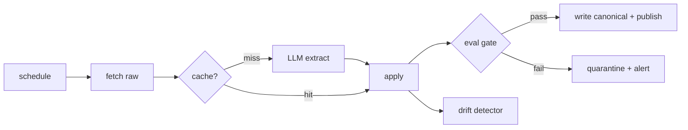

# Enterprise Data Refinery

**Turn hostile, heterogeneous documents into trustworthy structured data — locally, for free.**

Most "LLM document extraction" projects stop at *here's the JSON*. The Refinery ships the part
that lets you actually run that in production: a **trust-and-ops layer** wrapped around the
model — eval gates that fail closed, drift detection, provenance on every record,
observability, and cost accounting. The model does the extraction; the Refinery decides whether
the result is good enough to publish.

The document domain is swappable. A domain is a **Pack** — some config, a target schema, and its
eval checks. It ships with three reference Packs across three different AI tasks (extract /
triage / normalize) to show it isn't a one-trick pipeline.

## Why

The LLM call is the easy 30%. The 70% an enterprise pays for is trust: does this data defend
itself to an auditor, does it fail safely when a source silently changes format, what did it
cost, and can a non-engineer point it at a new pile of documents. That 70% is the project.

## The pipeline



Rich diagrams: [`docs/architecture.html`](docs/architecture.html).

## Run it

Everything is local Docker with a local model (Ollama). No paid API required.

```bash
docker compose up -d db ollama
docker compose exec ollama ollama pull qwen2.5:7b   # first run only (~5GB); the container starts empty
make migrate
uv run python -m edr.cli ingest extract              # runs the flagship pack end to end
docker compose up app                                # admin UI at http://localhost:8000
```

A real run on a local 14B-class model looks like this — including the trust layer doing its job:

```
[extract/permits-demo]     run=ok   drop=published    llm_calls=3 tokens=1500/378  would_be_claude=$0.0102
[normalize/usaspending]    run=ok   drop=quarantined  ← gate caught a missing field, did NOT publish
```

Swap in a frontier model (e.g. Claude) with a one-line env change (`EDR_LLM_PROVIDER=claude`) —
the model is a pluggable provider, not a dependency.

## Packs

| Pack | AI task | Substrate |
|---|---|---|
| `extract` | prose/PDF → structured facts | county building permits (swappable) |
| `triage` | free-text → category + severity + routing | CFPB consumer complaints |
| `normalize` | heterogeneous formats → one canonical schema | USAspending contracts |

Write your own: `cp -r packs/_template packs/<name>`, define a schema and checks,
`docker compose up`. Or use the admin app's **Add a source** wizard — no code. See
[CONTRIBUTING.md](CONTRIBUTING.md).

## The admin surface

Server-rendered (FastAPI + HTMX, no JS build): overview KPIs, run history, a live log stream, a
**gate-failure browser** (which checks failed, which rows), source management, a canonical
explorer with a per-row **provenance** drawer, output views (variation / change-over-time /
data-quality scorecard), and a cost readout ($0 local vs. would-be-Claude).

## Stack

Python 3.12 · FastAPI + HTMX + Jinja · SQLAlchemy/Alembic + Postgres · Ollama (local) ·
Dagster (scheduling) · Docker Compose · `uv`.

## License

MIT — see [LICENSE](LICENSE).
